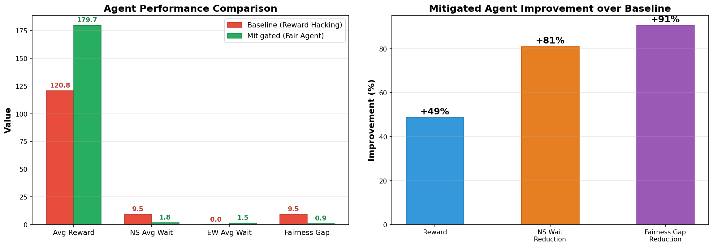
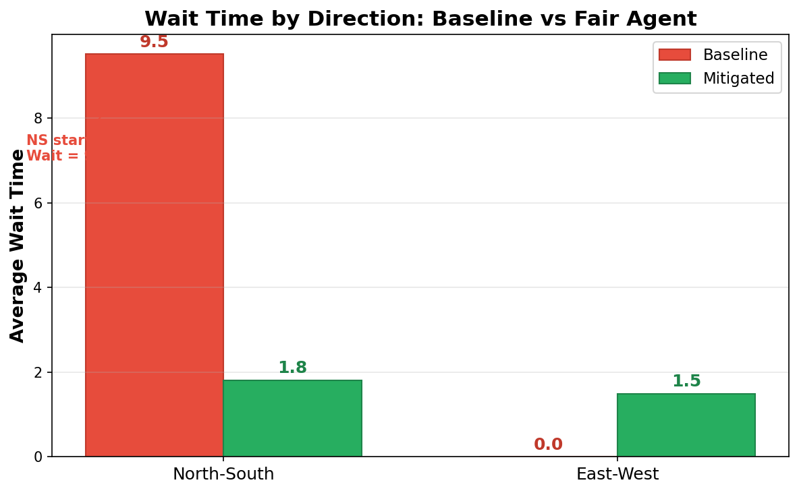

# Traffic Intersection RL: Reward Hacking Demo

> ### [Try the Live Demo →](https://challenge-2-rl-production.up.railway.app/)

Built a custom traffic intersection environment where an RL agent controls the signal (North-South vs East-West). Traffic is asymmetric - EW gets way more cars than NS - and this breaks a naive PPO agent in an interesting way. The agent learns to just keep EW green almost the entire time because that maximizes throughput. Technically correct reward-wise, but NS traffic gets starved and waits forever. Classic reward hacking.

## What's Actually Happening

The environment spawns cars with asymmetric rates: EW gets 0.28-0.5 arrival rate, NS only gets 0.05-0.15. The baseline PPO agent figures out pretty quickly that if it just leaves EW green, it serves way more cars and gets higher reward. So it does exactly that - EW stays green ~90% of the time, NS waits 12-15 seconds on average. The reward function never told it to care about fairness, so it doesn't.

Fixed this by:

- Adding a fairness penalty term to the reward (penalizes |NS_wait - EW_wait|)
- Adding time-to-collision (TTC) safety checks so it doesn't switch when cars are too close
- Using hard-case mining: re-train on scenarios where the baseline fails badly

## Technical Stack

**RL Framework:**

- `stable-baselines3` for PPO implementation (Proximal Policy Optimization)
- `gymnasium` for environment interface
- Used `MlpPolicy` for the policy network
- 4 parallel environments during training (`make_vec_env`) to speed things up
- Training hyperparams: `n_steps=512`, `batch_size=256`

**Environment Specs:**

- Observation space: 9-dimensional continuous vector (phase, time since switch, queue lengths, wait times, etc.)
- Action space: Discrete(2) → {0: keep EW green, 1: keep NS green}
- Episode length: 200 timesteps
- Reward = cars_served - fairness_penalty * |NS_wait - EW_wait| - safety_penalty * TTC_violations

**Frontend:**

- React + Vite for the interactive demo
- FastAPI server to serve trained models over REST
- Canvas API for rendering the intersection animation

## Files

How to Run Everything

### Backend (Training + API)

```bash
# Setup
python -m venv .venv
source .venv/bin/activate  # Windows: .venv\Scripts\activate
pip install -r requirements.txt

# Train baseline (this will show reward hacking)
python train.py --mode baseline --timesteps 200000 --model-out outputs/ppo_baseline.zip
# Takes ~10-15 min on M1 Mac, trains 4 parallel envs

# Evaluate baseline and see the unfairness
python evaluate.py --model outputs/ppo_baseline.zip --episodes 40 --hard-cases-out data/hard_cases_mined.json
# Should print avg NS wait ~12s, EW wait ~0.5s, fairness gap ~11.5

# Train mitigated (with fairness penalty)
python train.py --mode mitigated --timesteps 250000 --hard-cases data/hard_cases_mined.json --model-out outputs/ppo_mitigated.zip
# Uses fairness_weight=0.08 and scenario_pool_prob=0.4 (40% hard cases)

# Evaluate mitigated
python evaluate.py --model outputs/ppo_mitigated.zip --episodes 40
# Should print balanced wait times, fairness gap <2s

# Make charts
python plot_performance.py
# Saves to outputs/wait_time_comparison.png and outputs/performance_comparison.png

# Start API server (for frontend)
python api_server.py
# Runs on http://localhost:8000
# Loads outputs/ppo_baseline.zip and outputs/ppo_mitigated.zip by default
# Override with env vars: BASELINE_MODEL_PATH and FAIR_MODEL_PATH
```

### Frontend (Interactive Demo)

```bash
cd react-demo
npm install
npm run dev
# Open http://localhost:5173
```

The demo has two modes:

- **Hardcoded:** Simulates baseline vs fair with fixed logic (no models needed)
- **Model-Based:** Calls the API server to run actual trained PPO agents
  Results

### Performance Comparison



Fairness doesn't kill throughput.

## What You'll See: The Results

### Wait Time Comparison



**Key Finding:** Baseline agent creates massive unfairness.

### PPO Training Setup

Used `stable-baselines3` PPO with these settings ([`train.py`](train.py)):

```python
model = PPO("MlpPolicy", vec_env, verbose=1, n_steps=512, batch_size=256)
model.learn(total_timesteps=200_000)  # baseline
model.learn(total_timesteps=250_000)  # mitigated
```

- `MlpPolicy` = standard fully-connected network (default: 2 hidden layers, 64 units each)
- 4 parallel environments via `make_vec_env` (speeds up data collection)
- `n_steps=512` = rollout buffer size per env
- `batch_size=256` = minibatch size for gradient updates

### Environment Details

Observation space (9-dim vector):

```python
[
  phase,                    # 0 or 1 (EW vs NS)
  time_since_switch,        # normalized by max_steps
  ns_queue / max_queue,     # how many NS cars waiting
  ew_queue / max_queue,     # how many EW cars waiting
  avg_wait_ns / max_steps,  # avg wait time NS
  avg_wait_ew / max_steps,  # avg wait time EW
  visibility,               # 0.4-1.0 (weather/lighting)
  fast_car_prob,            # 0.02-0.18 (risk of fast cars)
  ttc_ns,                   # time to collision if switch to NS
]
```

Action space: `Discrete(2)` → agent picks 0 (EW green) or 1 (NS green) each timestep.

Reward function ([`traffic_env.py`](traffic_env.py)):

```python
reward = (
    throughput_reward * cars_served
    - queue_penalty * (ns_queue + ew_queue)
    - switch_penalty * (1 if switched else 0)
    - fairness_weight * abs(ns_wait - ew_wait)
    - safety_weight * ttc_violations
)
```

### Hyperparameters by Mode

**Baseline** ([`train.py`](train.py) line 52-58):

- `fairness_weight = 0.0` (no fairness penalty → reward hacking)
- `safety_weight = 2.0`
- `ttc_threshold = 1.2`
- `scenario_pool_prob = 0.0` (no curriculum learning)

**Mitigated** ([`train.py`](train.py) line 59-66):

- `fairness_weight = 0.08` (penalize wait time gap)
- `safety_weight = 3.0` (higher penalty for unsafe switches)
- `ttc_threshold = 1.4` (more conservative)
- `scenario_pool_prob = 0.4` (40% of episodes use hard cases)

### Hard Case Mining

[`evaluate.py`](evaluate.py) extracts scenarios where:

- Fairness gap > 3.0
- Safety violations happened (TTC < threshold during switch)

### Training Parameters Summary

**Baseline:**

- No fairness penalty (`fairness_weight = 0`)
- No safety penalty (`safety_weight = 0`)
- 200k timesteps

**Mitigated:**

- `fairness_weight = 0.1`
- `safety_weight = 2.0`
- `ttc_threshold = 3.0`
- 250k timesteps with 30% hard-case sampling

### API Server ([`api_server.py`](api_server.py))

FastAPI server that loads both trained models and exposes them via REST endpoints:

**Endpoints:**

- `GET /api/status` - Returns service status and whether models are loaded
- `POST /init` - Initialize a new episode with specified agent type (baseline or fair) and optional seed, returns unique episode_id
- `POST /step` - Execute one timestep using the model to predict action and step the environment
- `POST /reset` - Clear all active environment instances

**Request/Response:**

```python
# Initialize episode (creates new session)
POST /init
Body: {"agent_type": "baseline" | "fair", "seed": optional_int}
Returns: {"episode_id": "uuid", "observation": [float], "info": {...}}

# Step environment (uses episode_id for session isolation)
POST /step
Body: {"episode_id": "uuid"}
Returns: {"action": int, "observation": [float], "reward": float, "done": bool, "info": {...}}

# Reset all sessions
POST /reset
Returns: {"status": "reset", "cleared_sessions": true}
```

Each episode gets a unique `episode_id` to enable concurrent clients without interference. Sessions are automatically cleaned up when episodes complete.

**Configuration (Environment Variables):**

- `BASELINE_MODEL_PATH` - Path to baseline model (default: `outputs/ppo_baseline.zip`)
- `FAIR_MODEL_PATH` - Path to fair/mitigated model (default: `outputs/ppo_mitigated.zip`)
- `ALLOWED_ORIGINS` - Comma-separated CORS origins (default: `http://localhost:5173,http://localhost:3000`)
- `PORT` - Server port (default: `8000`)

Frontend calls these endpoints in [`useModelBasedSim.js`](react-demo/src/hooks/useModelBasedSim.js) to run the simulation in real-time.

## Files

| File                                                                                                | What it does                                              |
| --------------------------------------------------------------------------------------------------- | --------------------------------------------------------- |
| [`traffic_env.py`](traffic_env.py)                                                                   | Gymnasium environment, implements reward shaping          |
| [`train.py`](train.py)                                                                               | PPO training loop using stable-baselines3                 |
| [`evaluate.py`](evaluate.py)                                                                         | Run eval episodes, extract hard cases                     |
| [`api_server.py`](api_server.py)                                                                     | FastAPI server serving trained models                     |
| [`plot_performance.py`](plot_performance.py)                                                         | Matplotlib charts                                         |
| [`requirements.txt`](requirements.txt)                                                               | Python deps (stable-baselines3, gymnasium, fastapi, etc.) |
| [`data/hard_cases_seed.json`](data/hard_cases_seed.json)                                             | Hand-crafted edge cases                                   |
| [`data/hard_cases_mined.json`](data/hard_cases_mined.json)                                           | Auto-extracted failures from baseline                     |
| [`outputs/ppo_baseline.zip`](outputs/ppo_baseline.zip)                                               | Trained baseline model (reward hacker)                    |
| [`outputs/ppo_mitigated.zip`](outputs/ppo_mitigated.zip)                                             | Trained mitigated model (fair agent)                      |
| [`outputs/wait_time_comparison.png`](outputs/wait_time_comparison.png)                               | Wait time chart                                           |
| [`outputs/performance_comparison.png`](outputs/performance_comparison.png)                           | Throughput chart                                          |
| [`react-demo/src/App.jsx`](react-demo/src/App.jsx)                                                   | React app root                                            |
| [`react-demo/src/components/RewardHackingDemo.jsx`](react-demo/src/components/RewardHackingDemo.jsx) | Side-by-side comparison UI                                |
| [`react-demo/src/components/TrafficSimulation.jsx`](react-demo/src/components/TrafficSimulation.jsx) | Single agent view                                         |
| [`react-demo/src/hooks/useModelBasedSim.js`](react-demo/src/hooks/useModelBasedSim.js)               | Hook that calls API for model inference                   |
| [`react-demo/src/api/client.js`](react-demo/src/api/client.js)                                       | REST client wrapper                                       |

## Possible Extensions

- Try different RL algorithms (DQN)
- Add pedestrian crossings (another fairness dimension)
- Multi-intersection coordination
- Real traffic data instead of synthetic scenarios
- Compare to fixed-time controllers

## License

This is a demonstration project for educational purposes.
